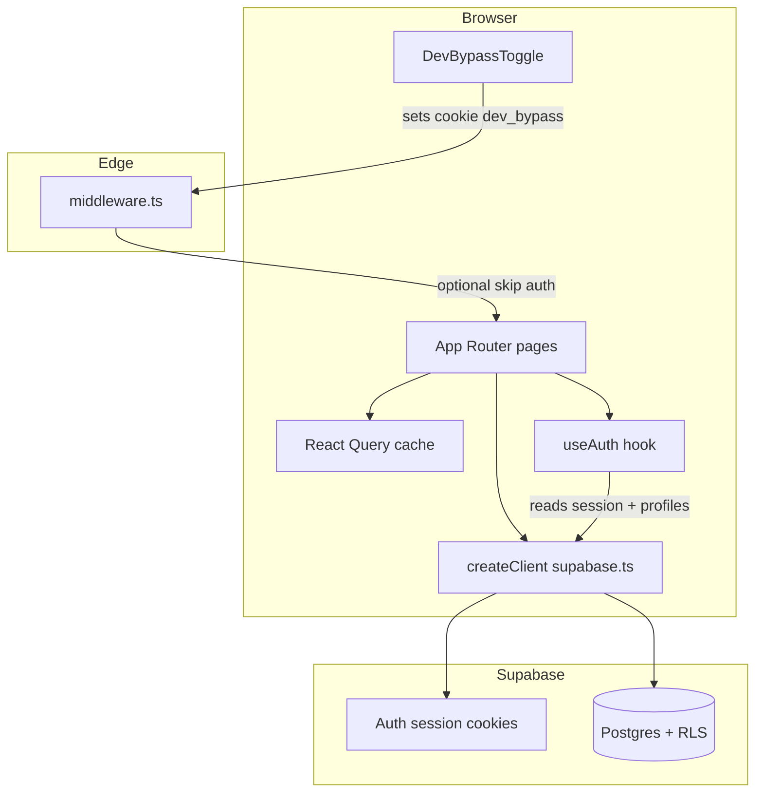

# Design Business Hub — Developer system documentation

This document describes how the application is wired together: authentication, Supabase, the admin **System** health page, and local development helpers. It is the canonical reference for engineers working in this repo.

---

## 1. Stack (source of truth)

| Layer | Technology |
|--------|------------|
| Framework | Next.js (App Router) — see `package.json` for exact version |
| Language | TypeScript |
| Styling | Tailwind CSS, shadcn/ui-style components under `src/components/ui/` |
| Data / auth | Supabase (Postgres, Auth, Row Level Security) |
| Server state | TanStack React Query (`@tanstack/react-query`) |
| Toasts | Sonner (`src/components/ui/sonner.tsx`) |

Project-specific Next.js APIs may differ from older Next docs; check `node_modules/next/dist/docs/` when unsure.

---

## 2. Architecture — what connects to what

### 2.1 Request flow (browser → edge → app)

- **Every navigated route** (except static assets) passes through **`middleware.ts`** (see `config.matcher`).
- **Supabase session** is established via cookies; `@supabase/ssr` syncs cookies on the server and browser.
- **Client-side data access** uses **`createClient()`** from [`src/lib/supabase.ts`](src/lib/supabase.ts) (browser Supabase client with anon key).
- **Server Components / Route Handlers** that need Supabase should use [`src/lib/supabase-server.ts`](src/lib/supabase-server.ts) (`createServerSupabaseClient`) where applicable.

### 2.2 Global providers

[`src/app/layout.tsx`](src/app/layout.tsx) wraps the tree with:

- **`Providers`** — `QueryClientProvider` for React Query ([`src/components/shared/Providers.tsx`](src/components/shared/Providers.tsx)).
- **`TooltipProvider`**, **`Toaster`** (Sonner).
- **`DevBypassToggle`** — floating dev-only control (see §7).

### 2.3 Role-based areas

| Route prefix | Layout | Who |
|--------------|--------|-----|
| `/admin/*` | [`src/app/admin/layout.tsx`](src/app/admin/layout.tsx) | Users whose `profiles.role === 'admin'` |
| `/account/*` | [`src/app/account/layout.tsx`](src/app/account/layout.tsx) | Signed-in non-admin clients (admins are redirected to `/admin`) |
| `/login` | Auth page | Unauthenticated entry |

**Root `/`** ([`src/app/page.tsx`](src/app/page.tsx)): server-side check — no user → `/login`; admin → `/admin`; else → `/account`.

---

## 3. Authentication details

### 3.1 Middleware ([`middleware.ts`](middleware.ts))

1. If cookie **`dev_bypass=1`** → request proceeds without Supabase auth (development convenience).
2. Otherwise builds a server Supabase client with request/response cookies, calls `getUser()`.
3. Unauthenticated users on non-public paths → redirect **`/login`**.
4. Public-ish paths: `/`, `/pay/*`, `/reset-password`, and auth pages `/login`, `/onboarding`.
5. Authenticated users on `/login` or `/onboarding` → redirect to **`/admin`** or **`/account`** based on **`profiles.role`**. Recovery users on **`/reset-password`** are not redirected away.

### 3.2 Client hook [`src/hooks/use-auth.ts`](src/hooks/use-auth.ts)

- Subscribes to Supabase session and loads **`profiles`** for the current user.
- Exposes `user`, `profile`, `loading`, `isAdmin`, `isClient`, `isProspect`, `signOut`.
- **Dev bypass**: if `document.cookie` contains `dev_bypass=1`, returns a **mock admin** user and profile so UI behaves as admin without a real session (must match middleware).

### 3.3 Environment variables

Required for Supabase (client and middleware):

- `NEXT_PUBLIC_SUPABASE_URL`
- `NEXT_PUBLIC_SUPABASE_ANON_KEY`

Set these in `.env.local` locally and in the hosting dashboard (e.g. Vercel) for production.

---

## 4. Database and schema

- Authoritative SQL snapshot: [`supabase/schema.sql`](supabase/schema.sql).
- The live Supabase project may include extra tables (e.g. `documents`, `organizations`) used by admin pages even if not every object appears in an older SQL dump.
- **RLS** applies to all client-side queries. Admin features assume policies allow admins to read/write the probed tables. If a table is missing or RLS denies access, probes and lists may show errors or empty data.

---

## 5. Admin **System** page (`/admin/system`)

**File:** [`src/app/admin/system/page.tsx`](src/app/admin/system/page.tsx)

Purpose: operational visibility — table reachability/counts, synthetic “recent activity,” cache refresh, environment labels, and a simple Supabase connectivity signal.

### 5.1 Data loading

- **`useQuery`** with key **`['system-health', user?.id]`** — runs only when `user` is present (`enabled: !!user`).
- Uses the **browser** Supabase client (same anon key and RLS as the rest of the admin UI).

### 5.2 Database table probes

For each name in `TABLE_NAMES` (profiles, clients, questionnaires, questionnaire_assignments, invoices, messages, files, documents, organizations):

- `supabase.from(name).select('*', { count: 'exact', head: true })`
- **Green dot** = no error; **red dot** = query failed (missing table, RLS, network).
- **Row count** shown when `ok` is true.

**Aggregate health badge:**

- All tables OK → **Healthy**
- Some OK → **Degraded**
- None OK → **Check tables**

### 5.3 Recent activity (last 7 days)

There is **no** dedicated `activity` log table. The page builds a **synthetic feed** by querying recent rows from:

- `messages`, `clients`, `invoices`, `files`, `questionnaires`, `questionnaire_assignments`, and `documents` (documents skipped if the query errors).

Rows are merged, sorted by `created_at` descending, and trimmed (implementation caps list length). Labels are human-readable strings (e.g. “New message”, “Client added: …”, “Invoice …”).

Timestamps use **`date-fns`** `formatDistanceToNow` (relative, e.g. “3 hours ago”).

### 5.4 System actions

- **Clear cache** — `queryClient.invalidateQueries()` so React Query refetches; Sonner toast confirms.
- **Environment** — `process.env.NODE_ENV`; optional `NEXT_PUBLIC_VERCEL_ENV` when set (e.g. on Vercel).
- **Supabase** — “Connected” if the **`profiles`** table probe succeeded; otherwise “Unavailable.”

### 5.5 Refresh

Header **Refresh** calls the query’s **`refetch()`** and shows a spinning icon while **`isFetching`** is true.

---

## 6. Viewing this documentation in the app

The same content is shipped as **[`/admin/development`](/admin/development)** (reads `docs/DEVELOPER_SYSTEM.md` at runtime). **Admin only** — same layout gate as other `/admin` routes.

In the repo, edit **`docs/DEVELOPER_SYSTEM.md`**; redeploy or refresh dev server to see updates on that page.

---

## 7. Dev bypass (local development)

**Component:** [`src/components/shared/DevBypassToggle.tsx`](src/components/shared/DevBypassToggle.tsx)

- Rendered only when `NODE_ENV === 'development'`.
- Sets **`dev_bypass=1`** cookie and navigates to `/admin` to enable bypass; clearing cookie redirects to `/login`.
- Must stay consistent with **`middleware.ts`** and **`useAuth`** mock behavior.

---

## 8. TypeScript and known debt

- Run `npx tsc --noEmit` for a full check.
- [`src/app/admin/clients/[id]/page.tsx`](src/app/admin/clients/[id]/page.tsx) has **pre-existing** issues (e.g. React Query v5 API changes, `asChild` on components that do not support it). Fix in a dedicated pass if needed.
- Other admin pages should remain clean; fix new errors when touching those files.

---

## 9. Deployment notes (typical: GitHub + Vercel + Supabase)

1. Connect the repo to Vercel (or similar).
2. Set **`NEXT_PUBLIC_SUPABASE_URL`** and **`NEXT_PUBLIC_SUPABASE_ANON_KEY`** in the project environment.
3. In **Supabase Auth → URL Configuration**, use these values for production (`dash.designworks.app`):

   | Setting | Value |
   |---------|--------|
   | **Site URL** | `https://dash.designworks.app` (origin only — not `/login`) |
   | **Redirect URLs** | `https://dash.designworks.app/reset-password`, `https://dash.designworks.app/login`, `http://localhost:3000/reset-password`, `http://localhost:3000/login` |

   Password reset emails use `redirectTo` → `/reset-password`. After changing Site URL / Redirect URLs, send a **new** reset email; old links keep the previous destination.
4. The System page’s **Vercel** badge appears only if **`NEXT_PUBLIC_VERCEL_ENV`** is injected (Vercel does this automatically on their platform when configured).

---

## 10. Gaps and follow-ups (not bugs in the System page itself)

- **Multi-tenancy / SaaS**: current model is largely a single business hub; scaling to multiple tenants usually requires explicit `organization_id` (or similar) on rows and stricter RLS — plan separately.
- **Invoice field naming**: some analytics code may reference legacy column names; align selects with the live DB and [`src/types/index.ts`](src/types/index.ts).
- **Activity feed**: synthetic only; for audit trails consider an `audit_log` table or Supabase triggers later.
- **Service role**: elevated operations should use server routes with the **service role** key — never expose it in `NEXT_PUBLIC_*` or client bundles.

---

## 11. Quick file index

| Concern | Location |
|---------|----------|
| Middleware / auth redirect | `middleware.ts` |
| Browser Supabase | `src/lib/supabase.ts` |
| Server Supabase helper | `src/lib/supabase-server.ts` |
| Auth state | `src/hooks/use-auth.ts` |
| React Query root | `src/components/shared/Providers.tsx` |
| System health UI | `src/app/admin/system/page.tsx` |
| DB schema reference | `supabase/schema.sql` |
| This doc (source) | `docs/DEVELOPER_SYSTEM.md` |
| In-app doc viewer | `src/app/admin/development/page.tsx` |

---

*Last updated to reflect the System page implementation and admin documentation route.*
